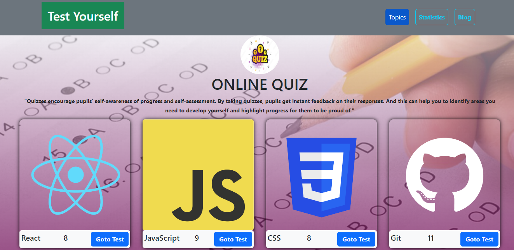
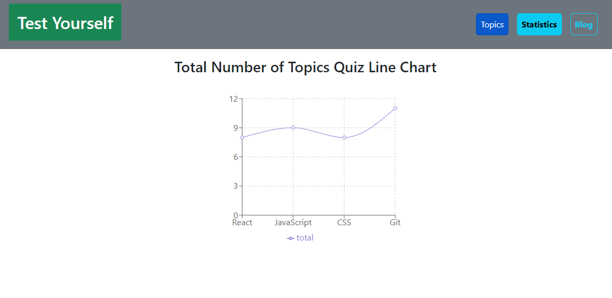
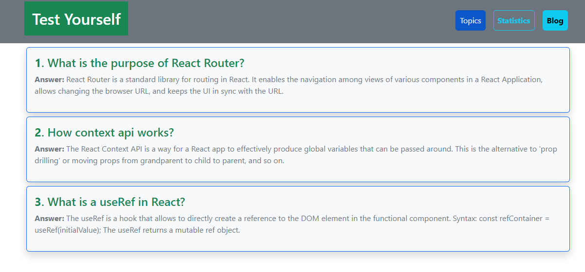

## Project Name

### Test Yourself

An application used to take quiz in four different topics, built with React, javaScript, Bootstrap and CSS.

## Project Status

This project is currently in development. Users can Perform the four different topics quiz test and also see the correct answer. Functionality has been used to show correct or wrong messages based on user activity.
Another feature I have shown the topics quiz data in a chart on the statistic page, and some blog posts have been shown on a Blog page.

## Project Screen Shot(s) 

<h3>Main Page and Quiz Page</h3>

  
  

<h3>Another Feature page</h3>

  
  

## Installation and Setup Instructions 

Clone down this repository. You will need `node` and `npm` installed globally on your machine.  

Installation:

`npm install`  

To Run Test Suite:  

`npm test`  

To Start Server:

`npm start`  

To Visit App:

`localhost:3000`  

Live site:

https://check-yourself.netlify.app
